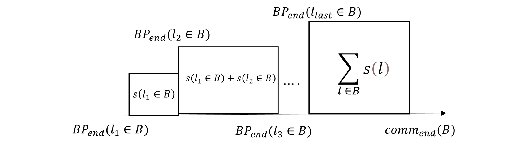
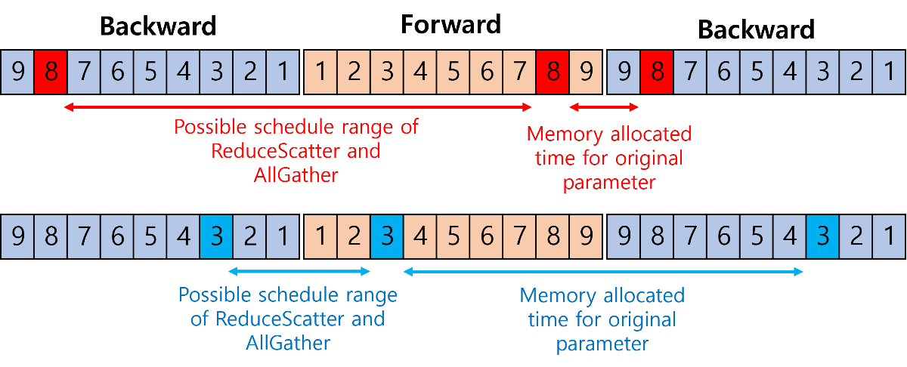
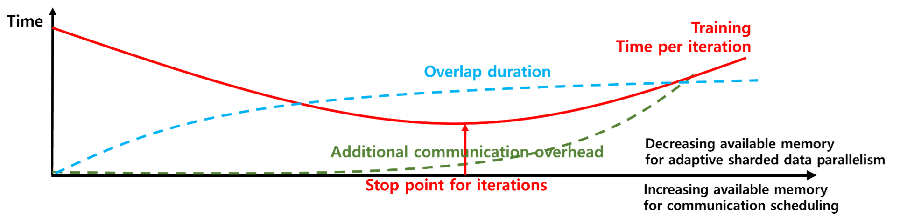

## 거대 딥러닝 모델 분산 학습의 샤드 데이터 병렬화를 위한 메모리 활용 최적화와 통신 스케쥴링 기법   

------

## 1. Motivation 
------
* 모델의 크기와 데이터셋의 크기가 증가에 따라 딥러닝 모델의 학습을 위한 연산 요구량은 또한 점차 증가함.
  * OpenAI 의 조사에 따르면 3.4 개월마다 모델의 학습 복잡도는 두배씩 증가함.
  * 예 : BDD100k 자율주행 데이터셋(1억 2천만 개의 이미지), GPU-3(1750억 개 파라미터)
  * 딥러닝 모델과 데이터셋의 크기는 추론 정확도와 밀접한 관련이 있음.
  * 문제 : 학습 시간 증가 및 모델 저장을 위한 메모리 요구량 증가

* 분산딥러닝 - 학습 시간을 감소시키고, 모델을 분할하여 메모리 요구량 감소가능.
* 데이터 병렬화 분산 딥러닝 - 학습 시간은 효율적으로 감소시킬 수 있으나 각 머신이 전체 모델의 파라미터를 전부 저장해야함. 
  * [데이터 병렬화의 통신 스케쥴링 기법](https://ieeexplore.ieee.org/abstract/document/9275615)(각 기법에 대한 자세한 내용은 링크 참조)
    * 텐서 퓨젼 : 연속된 레이어의 통신들을 병합하여 통신 부하를 감소
    * 텐서 파티셔닝 : 레이어의 통신을 분할하여 전파 과정과 연산 중첩  
* 샤드 데이터 병렬화 기반 분산 딥러닝 - 각 머신이 모델을 분산하여 저장하여 기존 데이터 병렬화 분산 딥러닝의 문제 해결 가능
* 기존 샤드 데이터 병렬화 기법의 한계
  * 통신 스케쥴링 기법 : 데이터 병렬화 분산 딥러닝에서 제시된 통신 스케쥴링 기법들은 샤드 데이터 병렬화 기법에 직접적 적용이 어려움. 이는 아래의 차이점으로 발생하는 문제임. 
  <br>

  |동기화 통신 특징 | 데이터 병렬화 기법 | 샤드 데이터 병렬화 기법 |
  |---|---|---|
  |통신유형 |단일 유형(AllReduce) | 복수의 유형( AllGather, ReduceScatter)|
  |연산 혹은 통신 의존성|역전파 연산 &rarr; AllReduce | 역전파 연산 &rarr; ReduceScatter   <br> ReduceScatter &rarr; AllGather <br> AllGather &rarr; 역전파 or 순전파  |
  |메모리 소비 모델 | 모델이 나누어 저장되지 않으므로 메모리 모델이 단순함.| 모델의 나누어   저장되어 메모리 소비 모델이 복잡함.  |


  * 전략이 아닌 스킴만 제시됨 : 기존 샤드 데이터 병렬화 기법은 모델 단위로 분할 전략을 선택하기 때문에 활용 가능한 메모리 크기에 맞추어 적응형으로 전략을 선택할 수 없음. 

---------
## 2. Objective 
-----------
* 메모리 제약 상황에서의 효과적인 메모리 활용을 위한 적응형 샤드 데이터 병렬화 기법 

* 샤드 데이터 병렬화 기반 분산 딥러닝을 위한 메모리 인지 스케쥴링 기법

* 두 기법 간 메모리 활용 관점에서의 학습 시간의 트레이드오프 관계 분석 및 최적화 
-----------

## 3. Method 
------

* 메모리 인지 통신 스케쥴링 기법 : 샤드 데이터 병렬화 기법은 기존 데이터 병렬화 기법을 활용해서 학습 시 메모리가 부족한 경우에 쓰일 것이므로, 샤드데이터 병렬화를 위한 메모리-인지 스케쥴링이 필요함. 
  * 메모리-인지 스케쥴링을 위한 정의요소
     * 블록(통신의 최소 크기 단위) : 스케쥴링 되는 통신 후보군들을 줄이기 위해서 대역폭을 포화시킬 수 있는 최소 메시지 크기 단위 정의 
     * 메모리 모델 : 각 통신 유형(AllReduce, ReduceScatter, AllGather)에 통신 스케쥴링 기법에 적용되는 경우별로 메모리 모델을 정의 

  </img>

     * Intger Linear Programming 을 통한 통신 스케쥴링 
       * 문제 공간 : 통신 후보군들의 통신 시작지점(각 레이어의 연산 시작 지점)을 2차원 행렬로 정의 
       * 최적화 목적 : 통신과 연산간의 중첩 공간을 최대화하기 
       * 제약 조건 
         * 제약 조건 1 : 각 통신 유형 별로 파라미터가 한번만 통신되어야 함.
         * 제약 조건 2 : 각 레이어 연산 과정에서의 메모리 활용량은 메모리 가용량보다 적어야함.
         * 제약 조건 3 : ReduceScatter와 AllGather 사이의 의존관계 


* 적응형 샤드 데이터 병렬화 전략 : 샤드 데이터 병렬화를 현재 메모리 한도에 맞추어 레이어별로 적응형으로 구성할 수 있는 방향 제시 
  * ㄹㄹ

</img>

* 최적 학습 시간 도출을 위한 메모리 활용 트레이드-오프 관계 파악 : 샤드 데이터 병렬화 전략을 현재 메모리 한도에 맞추어 레이어별로 설정한 후 통신 스케쥴링을 하더라도 이것이 최적 학습 시간을 도출할지 알 수 없음.
  * 예상 1 : 통신 스케쥴링을 위한 메모리 가용량을 늘려주면, 통신 스케쥴링의 유연성이 증가하여 일정 메모리 크기까지는 통신과 연산 간 중첩 비율이 증가하여 학습 시간이 감소할 것.
  * 예상 2 : 샤드 데이터 병렬화 전략에 활용될 메모리 가용량을 감소시키면, 메모리 소비가 조금 소비되는 샤드 데이터 병렬화 전략(예 : SDP &rarr; FSDP )로 바뀔 것이며, 이로 인해 학습 시간이 증가될 것.(샤드 데이터 병렬화의 두 가지 전략에 대한 설명은 [링크](https://fairscale.readthedocs.io/en/latest/deep_dive/oss_sdp_fsdp.html) 참조)
  * 예상 1과 예상 2를 조합하여, 아래의 학습 시간에 대한 가정을 도출할 수 있음. 

</img>

-------
## 4. 진행 상황 
--------
### 4.1 적응형 샤드 데이터 병렬화 
- [x] 각 샤드 데이터 병렬화 기법에 대한 구현 완료 .
- [ ] 랜덤한 샤드 데이터 병렬화 선택 전략에 대해 각 레이어 별로 적용(이 부분의 경우, 기존 프레임워크 코드를 분석한 상황이라 빠르게 구현될것으로 예상)

### 4.2 통신 스케쥴러
- [x] 기존 FairScale의 샤드 데이터 병렬화의 통신 부분을 분리(스케쥴링 목적을 위해 분리시킴)
- [x] 스케쥴링 테스트를 위한 랜덤 스케쥴링 생성기 구현 
- [ ] 분리된 통신 부분에 스케쥴링 기법을 적용(현재 텐서 퓨젼 적용 중)


### 4.3 ILP 문제 해결
- [x] ILP 라이브러리 테스트
- [x] ReduceScatter, AllGather 간 의존성관계에 대한 제약조건 구현을 위한 테스트
- [ ] 실제 ILP 문제 구현..


-------------------------

## 5. 실행방법
-------------------------
### 5.1 의존성

* [FairScale](https://github.com/facebookresearch/fairscale/tree/8acbec718f3c70a6b9785470bb9e05cd84fc3f8e) : 샤드 병렬화 부분을 가져와서 활용함. 
* [ByteScheduler](https://github.com/bytedance/byteps/tree/2749848707a414e7dee24a16852575340b6ddd47) : 스케쥴러 구현 부분에서 ByteScheduler의 방식(락 기반 통신-연산 동기화)을 차용
* PyTorch : 1.10.0 

--------------------
### 5.2 실행방법 

* 현재 스케쥴러 부분은 완전히 구현되있지 않음. (nccl 백엔드)
```
 python3.8 main.py --rank [여기에 rank 번호 기입] --shard 0 --mixed_precision 0
```
* slurm으로 구동시
  * 아래 스크립트로 지난번에 slurm에서 nccl 백엔드 썻었음. 아래 코드 수정해야됨. 


```
#SBATCH --time=1:00:00

#SBATCH --nodes=2
#SBATCH --ntasks-per-node=2
#SBATCH --gres=gpu:2
#SBATCH -p cas_v100_2
#SBATCH --comment pytorch
#SBATCH –o %x_%j.out
#SBATCH -e %x_%j.err
module purge
module load gcc/8.3.0 cmake/3.12.3 cuda/10.1 python/3.7.1
export NCCL_SOCKET_IFNAME=ib0
export CUDA_VISIBLE_DEVICES=0,1
export MASTER_PORT=12340
export WORLD_SIZE=4
#export NCCL_IB_QPS_PER_CONNECTION=16
#export NCCL_BUFFSIZE=1048576
### get the first node name as master address - customized for vgg slurm
### e.g. master(gnodee[2-5],gnoded1) == gnodee2
echo "NODELIST="${SLURM_NODELIST}

#if [ ${SLURM_NODELIST:7:1} == "," ]; then 
#    echo "MASTER_ADDR="${SLURM_NODELIST:0:7}
#    export MASTER_ADDR=${SLURM_NODELIST:0:7}
#elif [ ${SLURM_NODELIST:6:1} == "[" ]; then
#    echo "MASTER_ADDR="${SLURM_NODELIST:0:6}${SLURM_NODELIST:7:1}
#    export MASTER_ADDR=${SLURM_NODELIST:0:6}${SLURM_NODELIST:7:1}
#else
#    echo "MASTER_ADDR="${SLURM_NODELIST}
#    export MASTER_ADDR=${SLURM_NODELIST}
#fi 
### init virtual environment if needed
master_addr=$(scontrol show hostnames "$SLURM_JOB_NODELIST" | head -n 1)
export MASTER_ADDR=$master_addr
echo ${MASTER_ADDR}
### the command to run
srun ~/.conda/envs/0924/bin/python model_partitioner.py
#srun ~/.conda/envs/torch_env/bin/python test.py
```


